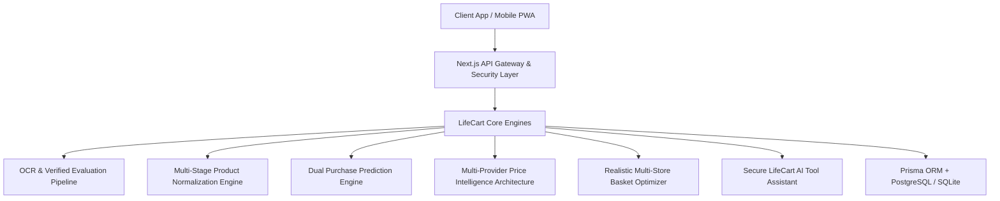

# LifeCart V1.0 — AI-Powered Smart Household & Shopping Assistant

LifeCart is a multi-tenant SaaS platform and university-level intelligent decision-support system designed for individuals, families, students, and roommates to manage everyday household activities, groceries, expense splits, price comparison, document storage, and warranty tracking.

---

## 🌟 Key Features

- **Shared Smart Grocery List**: Collaborative grocery shopping with auto-category detection.
- **OCR Receipt Extractor & Verified Evaluation**: Preprocessing, confidence scoring (0-100%), and user correction tracking.
- **Multi-Stage Product Normalization**: Brand detection, unit standardization (`ml`, `g`), and Jaccard fuzzy matching.
- **Dual Purchase Prediction Engine**: Baseline Mean Interval vs. Improved Exponential Decay models.
- **Multi-Provider Price Intelligence**: `PriceProvider` architecture (`RealApi`, `ReceiptDerived`, `Admin`, `Demo`).
- **Realistic Multi-Store Basket Optimizer**: Calculates travel time and transit cost trade-offs.
- **Secure LifeCart AI Assistant**: Grounded intent engine with explicit tool permissions.
- **University Evaluation Dashboard (`/admin/evaluation`)**: Server-secured research metrics visualizer.
- **GDPR Privacy & Data Governance Center (`/privacy`)**: 1-click JSON dataset export and household data isolation.

---

## 🏗️ System Architecture



---

## 🚀 Quick Setup & Local Execution

### 1. Installation
```bash
npm install
```

### 2. Database Migration & Seed
```bash
npx prisma db push --force-reset
npx tsx prisma/seed.ts
```

### 3. Automated Test Suite
```bash
node scripts/run-tests.js
```

### 4. Development Server
```bash
npm run dev
```

Visit **http://localhost:3000** in your browser.

---

## 🧪 University Research Metrics

Access the server-secured Evaluation Dashboard at `/admin/evaluation` (System Admin access required).

---

## 📄 License
MIT License.
